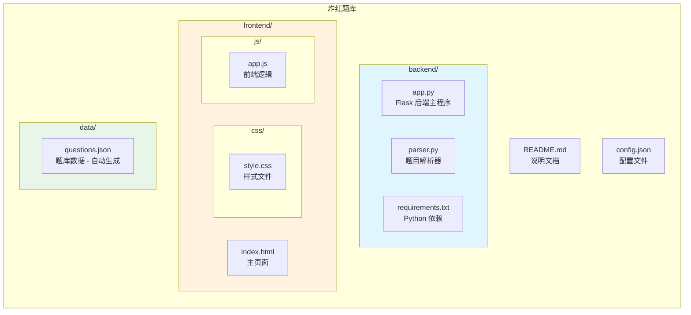

# dhu红课题库刷题系统

一个基于 Web 的题库导入与刷题系统，支持从 Word 文档（.doc/.docx）或纯文本文件（.txt）导入题目，并提供在线刷题功能。（目前仅测试2025-2026第一学期习概和毛概题库）

## 功能特性

- ✅ **题库导入**：支持 .doc、.docx 和 .txt 格式的题库文档导入
- ✅ **推荐TXT格式**：TXT格式可避免Word自动编号导致的选项识别问题
- ✅ **自动识别**：智能识别单选题和多选题，自动提取答案（支持A-F选项）
- ✅ **题库管理**：查看、编辑、删除题目和题库
- ✅ **刷题练习**：随机抽题、答案验证、正确率统计
- ✅ **模拟考试**：完整考试体验，提交前不显示答案，支持题目跳转
- ✅ **答题详情**：完成后查看每道题的作答结果和正确答案
- ✅ **成绩排行**：记录练习成绩，支持排行榜功能
- ✅ **数据持久化**：题库数据保存在本地，重启后无需重新导入
- ✅ **可配置存储**：可自定义数据存储路径

## 项目结构



## 快速开始

### 环境要求

- Python 3.8+
- pip 包管理器
- （可选）Microsoft Word（用于读取 .doc 格式文件）

### 1. 克隆项目

```bash
git clone https://github.com/xunlinxi/dhu-Redlesson-Questionbank.git
cd dhu-Redlesson-Questionbank
```

### 2. 安装依赖

```bash
cd backend
pip install -r requirements.txt
```

### 3. 启动服务

```bash
cd backend
python app.py
```

### 4. 访问系统

打开浏览器访问：http://localhost:5000

> **注意**：项目已包含预置题库数据（`data/questions.json`），克隆后即可直接使用，无需重新导入！

## 使用说明

### 导入题库

1. 点击左侧导航栏的"导入题库"
2. 将 .doc 或 .docx 文件拖入上传区域，或点击选择文件
3. 可选填写题库名称（留空则使用文件名）
4. 点击"开始导入"

### 题库格式要求

系统支持以下格式的题目文档：

```
第一章 章节名称

一、单项选择题
1、题目内容（ A ）
A 选项A    B 选项B
C 选项C    D 选项D

二、多项选择题
1、题目内容（ ABC ）
A 选项A
B 选项B
C 选项C
D 选项D
```

支持的答案格式：
- 中文括号：（A）、（ A ）、（ABC）
- 英文括号：(A)、( A )、(ABC)

### 刷题练习

系统提供两种练习模式：

#### 刷题模式
1. 点击"开始刷题"
2. 选择题库、章节和题目数量
3. 点击"开始刷题"按钮
4. 每题提交后立即显示正确答案
5. 可以切换上下题查看已答题目
6. 完成后查看练习统计和每道题详情

#### 模拟考试模式
1. 点击"模拟考试"
2. 选择题库、章节和题目数量
3. 答题过程中不显示正确答案
4. 可通过答题卡（①②③...）快速跳转题目
5. 提交试卷后才显示所有答案和得分
6. 完成后可逐题查看作答详情

### 系统设置

在"系统设置"页面可以：
- 修改数据存储路径
- 查看当前数据文件位置
- 清空所有数据

## 注意事项

1. 读取 .doc 文件需要系统安装 Microsoft Word
2. **推荐使用 .txt 格式**：可避免Word自动编号功能导致的选项识别问题
3. 如使用Word文档，建议先取消Word的自动编号功能，或复制粘贴为纯文本后保存为TXT
4. 题目格式需符合规范才能正确识别（见下方格式说明）

## 题目格式规范

### TXT文件格式示例

```
单选题

1. 中国特色社会主义最本质的特征是（ ）
A. 中国共产党的领导
B. 社会主义制度
C. 人民当家作主
D. 公有制经济
正确答案: A

多选题

2. 马克思主义中国化经历了哪几个历史阶段（ ）
A. 新民主主义革命时期
B. 社会主义革命和建设时期
C. 改革开放新时期
D. 中国特色社会主义新时代
正确答案: ABCD
```

### 格式要求
- 题目行需包含题号和答案占位符 `（ ）` 或 `( )`
- 选项格式：`A. 选项内容` 或 `A、选项内容` 或 `A.选项内容`
- 答案行：`正确答案: A` 或 `答案: ABC`
- 支持A-F共6个选项

## 技术栈

- **后端**：Python Flask
- **前端**：HTML5 + CSS3 + JavaScript
- **文档解析**：python-docx, pywin32
- **数据存储**：JSON 文件

## 许可证

MIT License
