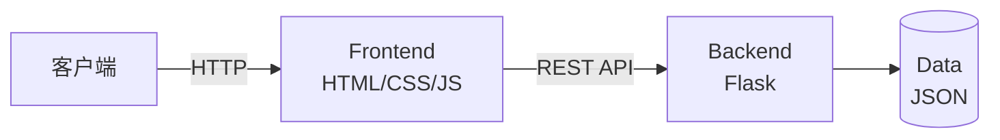

# DHU 红课题库刷题系统

基于 Web 的题库刷题系统，支持多格式题库导入、多种练习模式，可在局域网内多设备访问。
（当前仅测试 2025-2026 第一学期习概/毛概/思修/近代史题库）

## 功能概述

| 模块     | 功能                                        |
| -------- | ------------------------------------------- |
| 题库管理 | 导入(.doc/.docx/.txt)、编辑、删除、章节分类 |
| 练习模式 | 随机抽题、模拟考试、顺序做题、错题练习      |
| 练习配置 | 题库/章节筛选、题目数量、选项打乱、限时     |
| 数据管理 | 进度保存、错题本、成绩排行榜                |
| 多端访问 | 响应式设计、局域网/热点访问、远程模式       |

## 系统架构




## 快速开始

```bash
# 安装依赖
python -m venv .venv
.venv\Scripts\activate
pip install -r requirements.txt

# 启动服务
python main.py
````

浏览器自动打开 http://localhost:50000

## 多设备访问

| 访问方式 | 地址                       | 配置                             |
| -------- | -------------------------- | -------------------------------- |
| 本机     | http://127.0.0.1:50000     | 无需配置                         |
| 局域网   | http://192.168.x.x:50000   | 运行 `setup_firewall.bat`        |
| 热点     | http://192.168.137.1:50000 | 运行 `防火墙开关.bat` 关闭防火墙 |

## 题库格式

```
一、单项选择题
1、题目内容（A）
A. 选项A
B. 选项B

二、多项选择题
1、题目内容（ABC）
A. 选项A
B. 选项B
```

## 技术栈

- 后端：Python Flask
- 前端：HTML5 + CSS3 + JavaScript
- 文档解析：python-docx, pywin32
- 数据存储：JSON

## 注意事项

1. 推荐使用 TXT 格式导入题库
2. .doc 文件解析需要安装 Microsoft Word（仅 Windows）
3. 热点访问需临时关闭防火墙，使用后请重新开启

## 许可证

MIT License
